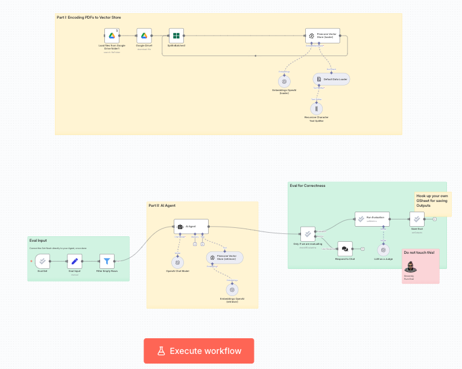

# Agente RAG no n8n para o Agentic Arena

## 📄 Resumo do Desafio
O **Agentic Arena Community Contest** é uma competição da comunidade n8n que desafia participantes a criar um agente de IA com **RAG (Retrieval-Augmented Generation)** capaz de responder perguntas com base em um conjunto de PDFs fornecido.  
O agente deve:
- Ingerir documentos PDF em um banco de dados vetorial
- Processar perguntas em linguagem natural
- Responder com base apenas na documentação fornecida, citando as fontes
- Obter alta precisão em um conjunto de questões de avaliação

Mais detalhes: [Página oficial do desafio](https://n8n.notion.site/Agentic-Arena-Community-Contest-2645b6e0c94f80729e0ec9b8ed036a95)

---

## 🚀 Minha Solução
Implementei um agente RAG no **n8n** usando:
- **OpenAI text-embedding-3-large** para gerar embeddings
- **Pinecone** para armazenamento vetorial
- **GPT-5** e **GPT-5 mini** para geração de respostas

### Estratégia
- Utilizar embeddings para busca semântica no Pinecone
- Configurar o agente para responder após no máximo 5 tentativas
- Trocar para o modelo GPT-5 mini para reduzir tempo de execução e evitar timeouts

### Obstáculo
O agente travava em perguntas complexas, executando iterações excessivas ou atingindo timeout.

### Solução
- Adicionei instrução no **system prompt** para limitar a 5 tentativas
- Troquei o modelo para **GPT-5 mini**
- Resultado: agente passou a responder todas as perguntas

---

## 🛠 Tecnologias Utilizadas
- [n8n](https://n8n.io) (versão 1.109.2)
- [OpenAI API](https://platform.openai.com/)
- [Pinecone](https://www.pinecone.io/)

---

## 🗂 Arquitetura do Workflow

---

## 📦 Como Executar

1. **Instale o n8n** (versão 1.109.2 ou superior)
2. **Configure as credenciais**:
   - **OpenAI API Key**: crie em [OpenAI](https://platform.openai.com/)
   - **Pinecone API Key**: crie em [Pinecone](https://www.pinecone.io/)
3. **Importe o workflow** (`AgenticArena_Challenge1_StarterWorkflow.json`)
4. **Conecte o conjunto de avaliação** (Google Sheets) ao workflow
5. **Execute o fluxo** e verifique as respostas

---

## 📊 Resultados
Avaliação (escala 1-5):  
`4, 4, 3, 2, 4, 4, 4, 3`

🎥 [Assista ao vídeo da submissão](submission/N8N%20Agentic%20Arena%20-%20Leo%20Pabon.mp4)

---

## 💡 Aprendizados
- Configuração estratégica e refinamento de prompt podem ser mais impactantes que apenas escolher o modelo mais avançado
- Limitar tentativas evita loops e timeouts
- Modelos menores podem ser mais eficientes em cenários específicos

---

## 📜 Licença
Este projeto é de código aberto e pode ser utilizado livremente.

---

# 🇬🇧 English Version

## 📄 Challenge Summary
The **Agentic Arena Community Contest** is an n8n community competition challenging participants to build a **Retrieval-Augmented Generation (RAG)** AI agent capable of answering questions based on a provided PDF knowledge base.  
The agent must:
- Ingest PDF documents into a vector database
- Process natural language questions
- Return answers based solely on the provided documentation with proper citations
- Achieve high accuracy on an evaluation question set

More details: [Official challenge page](https://n8n.notion.site/Agentic-Arena-Community-Contest-2645b6e0c94f80729e0ec9b8ed036a95)

---

## 🚀 My Solution
I implemented a RAG agent in **n8n** using:
- **OpenAI text-embedding-3-large** for embeddings
- **Pinecone** for vector storage
- **GPT-5** and **GPT-5 mini** for answer generation

### Strategy
- Use embeddings for semantic search in Pinecone
- Configure the agent to answer after a maximum of 5 attempts
- Switch to GPT-5 mini to reduce execution time and avoid timeouts

### Obstacle
The agent stalled on complex questions, running excessive iterations or hitting timeouts.

### Solution
- Added a **system prompt** instruction to limit to 5 attempts
- Switched to **GPT-5 mini**
- Result: the agent answered all questions

---

## 🛠 Technologies Used
- [n8n](https://n8n.io) (version 1.109.2)
- [OpenAI API](https://platform.openai.com/)
- [Pinecone](https://www.pinecone.io/)

---

## 🗂 Workflow Architecture

---

## 📦 How to Run

1. **Install n8n** (version 1.109.2 or higher)
2. **Set up credentials**:
   - **OpenAI API Key**: create at [OpenAI](https://platform.openai.com/)
   - **Pinecone API Key**: create at [Pinecone](https://www.pinecone.io/)
3. **Import the workflow** (`AgenticArena_Challenge1_StarterWorkflow.json`)
4. **Connect the evaluation set** (Google Sheets) to the workflow
5. **Run the flow** and check the answers

---

## 📊 Results
Evaluation (scale 1-5):  
`4, 4, 3, 2, 4, 4, 4, 3`

🎥 [Watch submission video](submission/N8N%20Agentic%20Arena%20-%20Leo%20Pabon.mp4)

---

## 💡 Lessons Learned
- Strategic configuration and prompt refinement can be more impactful than simply choosing the most advanced model
- Limiting attempts prevents loops and timeouts
- Smaller models can be more efficient in specific scenarios

---

## 📜 License
This project is open-source and free to use.